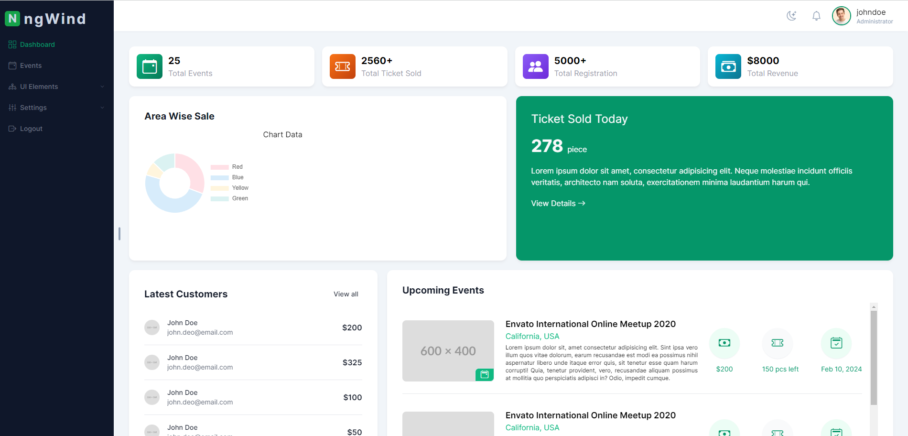

# Ng-Wind (Angular Powered Tailwind CSS Minimal Admin Template)



ngWind is a free to use minimal dashboard template designed and developed with Angular and Tailwind CSS. This template is highly customizable and easy to use. Currently the template has few features, enough to kick start your project.

## ✨ Frameworks

- Angular 17
- Tailwind CSS

## 🚀 Quick Start

Make sure you have `node js` and `angular cli` installed your machine. Next follow these steps - 

1. Clone this repository.

2. Execute the following command and install required dependencies.
    ```
    npm install
    ```

3. After Installing the dependencies, execute the following command
    ```
    ng serve --open
    
    or

    ng s -o
    ```

    After successfull build, the application will 🚀 launch into your browser in `http:\\localhost:4200` port.


## 📄 How to discuss

If you find any issue, bug or any improvement start by making sure that it hasn't been already reported. You can search through the [issues](https://github.com/ANrajin/ngWind/issues) list.

If not then [create a new issue](https://github.com/ANrajin/ngWind/issues/new) and provide some description that explain what changes or improvement is needed.


## 💻 How to contribute

Contributors are highly welcome. Please read the contribution guide before starting.

- Firstly, it's important to have some knowledge about the latest stable version of Angular, Angular CLI and Tailwind CSS, as we prefer to utilize the newest features provided by the framework as soon as they become available.

- Please look at the [folder structure]() and understand it properly. We prefer a meaningful and easy to use a architecture so that any one who is a beginner also can understand the project easy and customize it based on their needs.

- Fork the repository into you `github` account and clone it locally and install dependencies and run.

- Contribute your changes and commit them. Please make sure to use proper commit message in your work and avoid to create a large `Pull Request` so that the reviewer can review your contribution easy.

- We prefer to follow `#Issue number - Pull Request Title` For example: `#2 - This is a sample pull request` this format for PR title. Open the `Pull Request` into the repositoris `develop` branch.

## ✅ Licence

ngWind is licensed under the MIT license, making it free to use for personal or portfolio projects 😊. Please note that the maintainers are not responsible for providing any `professional support or updates`.
